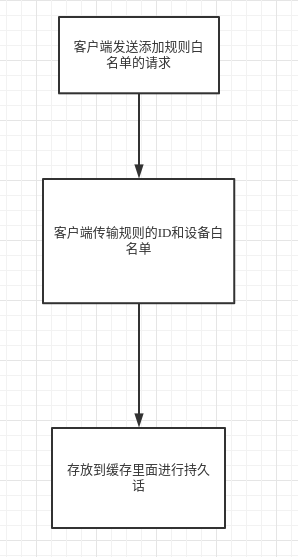
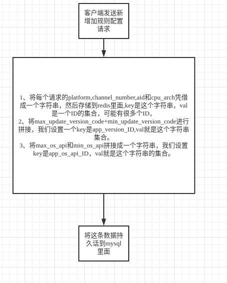
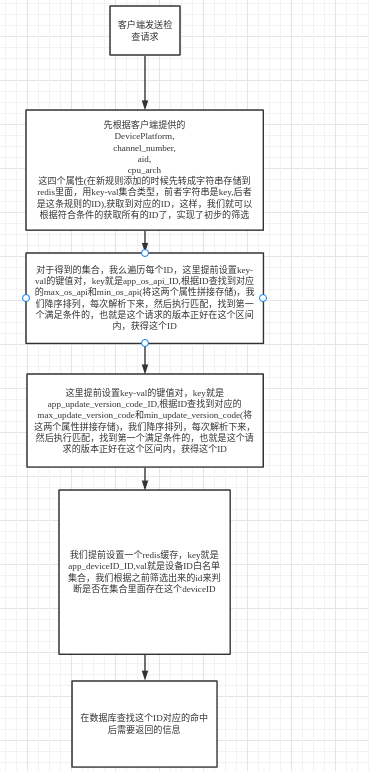

# techtrainingcamp-AppUpgrade
字节跳动后端训练营代码提交(仅供小组学习，请勿传播)

### 项目排期
[项目要求](https://docs.qq.com/doc/DTGFPVWRrRVZMWlVX)

[项目排期](https://docs.qq.com/sheet/DTGRLV3Rja0Rrb0Fi?tab=BB08J2)

### 规则相关接口redis处理流程图
+ 图1

+ 图2

+ 图3

### 基本使用
+ git克隆项目 `git clone git@github.com:Peterliang233/techtrainingcamp-AppUpgrade.git`
+ 进入项目根目录 `cd techtrainingcamp-AppUpgrade`
+ 拉取依赖 `go mod tidy`
+ 修改数据库配置，进入config文件夹里面，对config.ini文件进行修改，主要修改数据库登录用户和密码
+ 进入数据库执行数据库脚本
+ 运行项目 `go run main.go`

### 部署
#### 后端部署
+ 直接进入deploy文件夹下面，执行`docker-compose -f docker-compose.yml up --build -d `就可以部署后端项目

#### 前端部署
+ 略